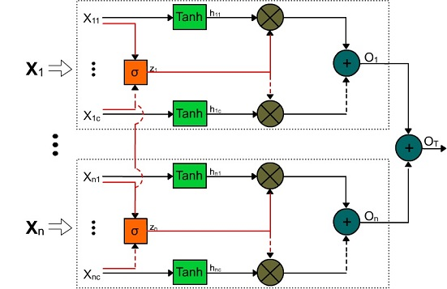

# A Minimal Gated Multi-Modal Unit for Sensor Fusion in Insurance Telematics

This is a companion repository for our paper titled ["A Minimal Gated Multi-Modal Unit for Sensor Fusion in Insurance Telematics"](https://ieeexplore.ieee.org/document/10234395).

## Minimal Gated Multi-Modal Unit (mGMU) diagram.

## Equations that governs our proposed mGMU

\begin{equation}
	h_{ij} = \tanh\left ( W_{i} \cdot X_{ij}\right),\;\text{para }\;i = 1,\ldots,n,\;\text{y }\;j = 1,\ldots,C
\end{equation}

\begin{equation}
	z_{i} = \sigma \left (\left [ X_{1},\dots, X_{n} \right ] \cdot 
  \left [
  \underbrace{        
   Wz_{i},\dots,Wz_{i} 
     }_{n \text{ times}}
  \right ]
 \right ),\;\text{para }\;i = 1,...,n
\end{equation}

\begin{equation}
	O_{T} = \sum _{i=1}^{n}  \sum _{j=1}^{C} \left ( z_{i} \ast h_{ij} \right )
\end{equation}

\begin{equation}
\Theta = \left \{ W_{11},..., W_{nC}, Wz_{1},...,Wz_{n} \right \}
\end{equation}

## Folder Content

_BOFM  (Implements the Bag of Features algorithm for a multivariate time series)
- BoFM.py    
- BoFM_extraccion.py:  

_Gates (mGMU and GMU keras layers)
- Gates.py

_UAH_timeSeries (time series dataset from [UAH-Driveset](http://www.robesafe.uah.es/personal/eduardo.romera/uah-driveset/))
- UAH.mat (Matlab binary file)

_root
- BoFM-mGMU-FCL-UAH.ipynb (Example of BOFM as feature extractor stage)
- mgmu.jpg  (mGMU diagram)
- modelos.py (Function to build the keras models used in the article)
- Models_test.ipynb (modelos.py use example (2Ires_mGMU_GAP_FCL model))
- README.md (this file)
